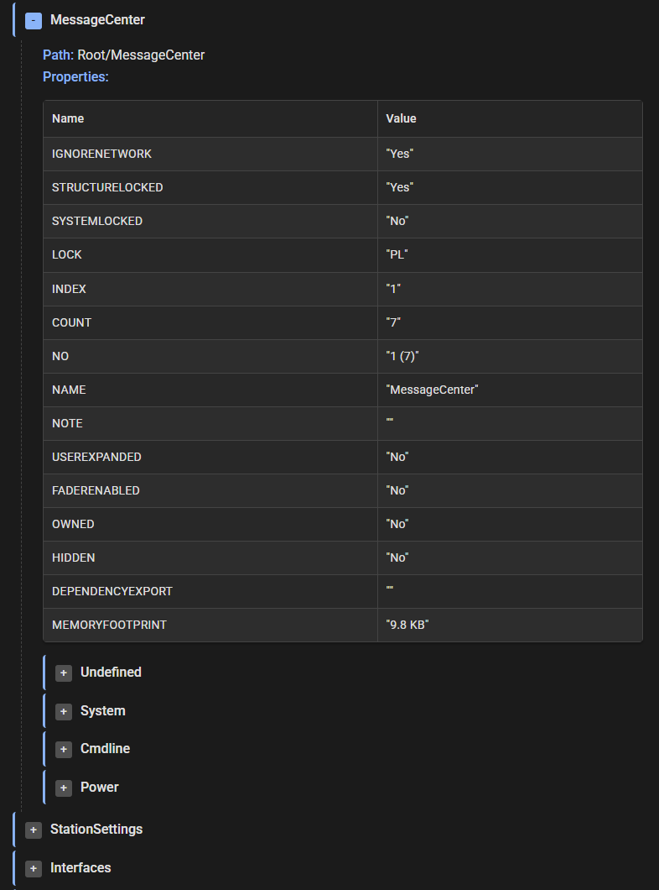
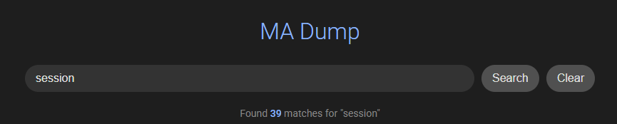
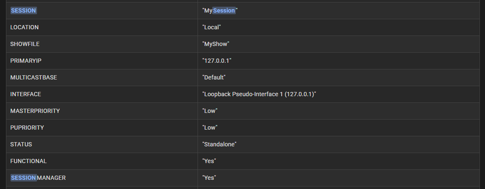

# Ma3 Root Dump to HTML

This tools export Ma3 Root() and build an HTML with properties and children infos.

A demo page is available [here](https://carrot-industries.com/Ma3RootBumpToHtmlDemo/DumpWeb.html).

You can search for terms to easily find what you need

Those tools consist of a plugin to Dump data, the [gMA3-SysMon-Logger written by Luke Chikkala](https://github.com/lukechikkala/gMA3-SysMon-Logger/tree/main) to get dumped data in a text file, a python script to remove time and message prefixes, and another python script to build the html file.

## How to generate your file

- Import the [RootDump.xml](RootDump.xml) plugin in your Ma3 show
- Launch the [Ma3SysMonLogger.vbs](Ma3SysMonLogger.vbs), you can customize defaults inside the script
- Edit the system file to remove the lines before "Root Dump Start" an after "Root Dump Finish"
- Rename the file as MaDump.txt
- Run the [DumpCleaner.py](DumpCleaner.py)
- Run the [DumpToHtml.py](DumpToHtml.py)
